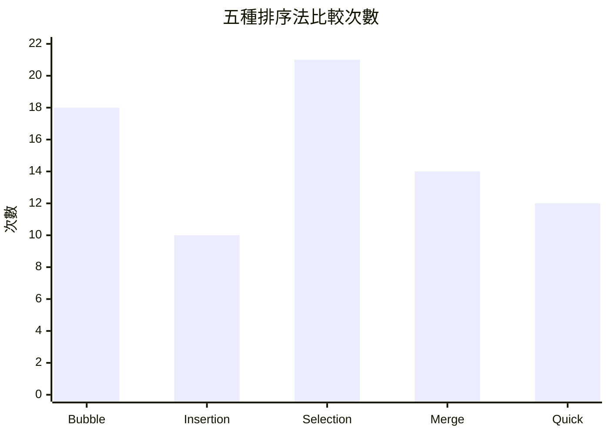
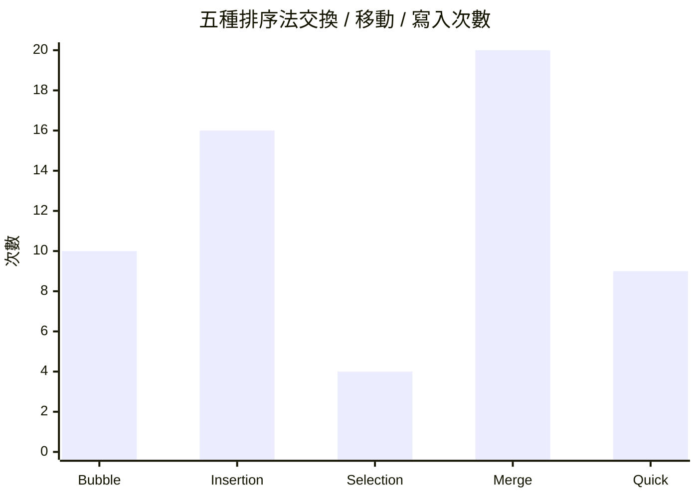

# 排序演算法互動報告

## 專案概述

這個專案包含五種常見排序法的互動式教學頁面，分別是氣泡排序、插入排序、選擇排序、合併排序與快速排序。每個頁面都提供演算法原理、時間與空間複雜度、偽代碼、視覺化執行過程，以及比較次數與交換次數的即時統計。

## 五種排序法總整理

### 1. 氣泡排序法

氣泡排序透過反覆比較相鄰元素，將較大的數值逐步交換到右側，最後讓最大值像氣泡一樣浮到序列尾端。這種方法結構簡單，適合用來理解交換排序的基本概念。

- 時間複雜度：最佳 O(n)，平均 O(n^2)，最壞 O(n^2)
- 空間複雜度：O(1)
- 穩定性：穩定
- 示範資料統計：比較 18 次，交換 10 次
- 偽代碼重點：雙層迴圈、相鄰比較、必要時交換、若一輪沒有交換則提早結束

### 2. 插入排序法

插入排序把陣列切成已排序區與未排序區，每次取出未排序區的第一個元素，往左側已排序區找到正確位置後插入。它在接近排序完成的資料上表現不錯，也很容易看出「搬移」而不是「整批交換」的特性。

- 時間複雜度：最佳 O(n)，平均 O(n^2)，最壞 O(n^2)
- 空間複雜度：O(1)
- 穩定性：穩定
- 示範資料統計：比較 10 次，移動 16 次
- 偽代碼重點：取出 current、向左回推、把較大的元素往右移、最後插入 current

### 3. 選擇排序法

選擇排序每一輪都在未排序區間中找出最小值，再把它放到目前區間的最前面。它的比較次數幾乎固定，因此很適合觀察「比較成本固定、交換次數較少」這件事。

- 時間複雜度：最佳 O(n^2)，平均 O(n^2)，最壞 O(n^2)
- 空間複雜度：O(1)
- 穩定性：不穩定
- 示範資料統計：比較 21 次，交換 4 次
- 偽代碼重點：記錄最小索引、掃描剩餘元素、必要時交換到前面

### 4. 合併排序法

合併排序使用分治法，先把資料切成更小的區段，直到只剩單一元素，再把兩個已排序子陣列合併回去。它的核心不是交換，而是有系統地比較與寫回，因此很適合用來理解遞迴與額外空間的使用方式。

- 時間複雜度：最佳 O(n log n)，平均 O(n log n)，最壞 O(n log n)
- 空間複雜度：O(n)
- 穩定性：穩定
- 示範資料統計：比較 14 次，寫入 20 次
- 偽代碼重點：遞迴切半、左右遞迴排序、merge 階段依序比較並寫回

### 5. 快速排序法

快速排序同樣使用分治法，但流程是先選擇 pivot，將較小元素放左邊、較大元素放右邊，再對左右子區間遞迴處理。它在平均情況下非常高效，但若 pivot 選得不好，效能會明顯下降。

- 時間複雜度：最佳 O(n log n)，平均 O(n log n)，最壞 O(n^2)
- 空間複雜度：O(log n)
- 穩定性：不穩定
- 示範資料統計：比較 12 次，交換 9 次
- 偽代碼重點：partition 分割、pivot 固定、左右遞迴、最後完成排序

## 示範資料與統計圖表

本專案的互動頁面預設資料為：[7, 3, 9, 2, 6, 4, 8]。下表整理五種排序法在這組資料上的操作統計。為了忠實反映頁面行為，插入排序的欄位使用「移動次數」，因為它的程式主要記錄元素搬移與插入，而不是單純的元素交換。

| 排序法 | 比較次數 | 交換/移動/寫入次數 | 穩定性 |
| --- | ---: | ---: | --- |
| 氣泡排序 | 18 | 10 | 穩定 |
| 插入排序 | 10 | 16 | 穩定 |
| 選擇排序 | 21 | 4 | 不穩定 |
| 合併排序 | 14 | 20 | 穩定 |
| 快速排序 | 12 | 9 | 不穩定 |

### 比較次數圖表

### 交換 / 移動 / 寫入次數圖表

## 觀察重點

- 氣泡排序與插入排序都屬於穩定排序，適合拿來比較相鄰交換與逐步插入的差異。
- 選擇排序的比較次數固定很高，但交換次數少，適合在「交換成本昂貴」的情況使用。
- 合併排序的寫入次數較多，但時間複雜度穩定，適合大型資料。
- 快速排序平均效率高，實作時最需要注意 pivot 的選擇。

## 新增心得

這份作品是我與人工智慧協作完成的。在整理五種排序法的內容時，我先把各頁面的重點、複雜度、偽代碼和統計資料整理出來，再利用人工智慧幫助我把零散資訊整合成更完整、更有條理的報告。透過這種合作方式，我不只是完成作業，也更清楚看到人工智慧在資料整理、文字組織與內容補充上的幫助。

在實作過程中，我也感受到人工智慧能快速協助我檢查重點、比較不同排序法的差異，並且把比較次數、交換次數與寫入次數整理成容易閱讀的統整表格。這讓我在撰寫報告時能更專注於理解演算法本身，而不是花太多時間處理格式或重複敘述。整體來說，這次經驗讓我學到如何善用人工智慧作為學習與整理資訊的工具，並把它變成提升效率與品質的合作夥伴。

